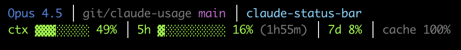

# claude-usage

A custom statusline for [Claude Code](https://claude.ai/code) that displays usage limits, context window, cache stats, and session info.



## Features

**Line 1: Session Info**
- Model name (blue)
- Directory and git branch (magenta)
- Session name (cyan) or full UUID in orange if unnamed (as a reminder to `/rename`)

**Line 2: Usage Metrics**
- Context window usage with progress bar
- 5-hour usage limit with countdown timer
- 7-day usage limit
- Cache hit rate

Colors indicate usage levels:
- Green: < 60%
- Yellow: 60-85%
- Red: > 85%

## Installation

### Build from source

```bash
git clone https://github.com/LXXero/claude-usage.git
cd claude-usage
go build -o claude-usage
cp claude-usage ~/.local/bin/
```

### Configure Claude Code

Add to `~/.claude/settings.json`:

```json
{
  "statusLine": {
    "type": "command",
    "command": "~/.local/bin/claude-usage"
  }
}
```

## Cross-Platform Support

- **macOS**: Reads credentials from Keychain (`Claude Code-credentials`)
- **Linux**: Reads credentials from `~/.claude/.credentials.json`

## How It Works

- Fetches usage limits from `https://api.anthropic.com/api/oauth/usage`
- Reads session info from Claude Code's stdin (passed automatically)
- Looks up session names from `~/.claude/projects/*/sessions-index.json`
- Reads cache stats from session transcript files

## License

GPL-3.0
